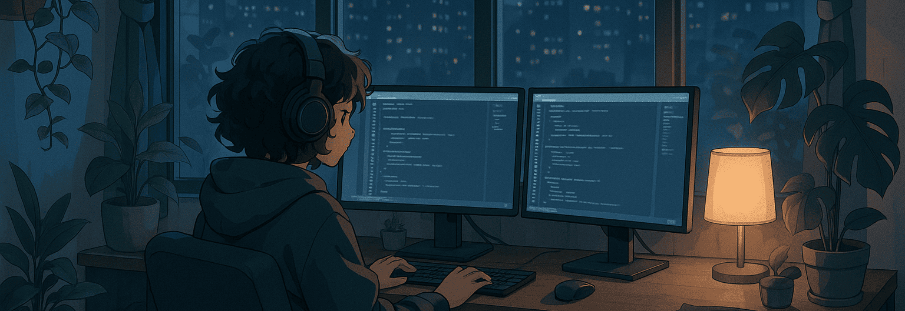

<h2 align="left">Hi 👋! My name is Mitzi and I'm a Jr. Front-End Developer</h2>

###

###

- 🔭 I’m working as fulltime Jr. Front-End Developer - 📚 I'm currently learning React - 🎨 In my free time I enjoy drawing and building robots - 🌎 I'm from Mexico - 💼 I have two years of experience in front-end development - 🎓 I'm currently pursuing a Bachelor’s degree in Computer Systems Engineering

###

<h2 align="left">Stack</h2>

###

  
  
  
  
  
  
  
  
  
  
  

###

<h2 align="left">Tools</h2>

###

  
  
  
  
  
  
  
  
  
  
  
  
  
  
  
  
  

###

<h2 align="left">Social</h2>

###

  
  

###

 

